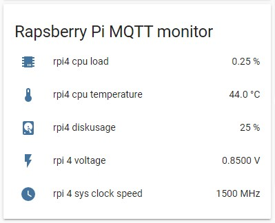

# Raspberry Pi MQTT Monitor

        

The easiest way to track your Raspberry PI or Ubuntu computer system health and performance with Home Assistant.

Monitor: cpu load, cpu temperature, free space, used memory, swap usage, uptime, wifi signal quality, voltage and system clock speed.

Raspberry Pi MQTT Monitor supports discovery messages so no manuall configuration in [Home Assistant](https://www.home-assistant.io/) configuration.yaml is needed.

You can install it with just one command from shell.
 
Configurable: You can select what is monitored and how the message is sned (separetely or as a bulk csv message)

# Installation

## Automated

Run this command to use the automated installation:

```bash
bash <(curl -s https://raw.githubusercontent.com/hjelev/rpi-mqtt-monitor/master/remote_install.sh)
```
Raspberry Pi MQTT monitor will be intalled in the location where the installer is called, inside a folder named rpi-mqtt-monitor.

The auto-installer needs the software below and will install it if its not found:
* python (2 or 3)
* python-pip
* git
* paho-mqtt

Only python is not automatically installed, the rest of the dependancies should be handeled by the auto installation.
It will also help you configure the host and credentials for the mqtt server in config.py and create the cronjob configuration for you.

## Manual
If you don't like the automated installation here are manuall installation instructions:

1. Install pip if you don't have it:
```bash
$ sudo apt install python-pip
```
2. Then install this python module needed for the script:
```bash
$ pip3 install paho-mqtt
```
3. Install git if you don't have it:
```bash
$ apt install git
```
4. Clone the repository:
```bash
$ git clone https://github.com/hjelev/rpi-mqtt-monitor.git
```
5. Rename ```src/config.py.example``` to ```src/config.py```

## Configuration
(only needed for manual installation)
Populate the variables for MQTT host, user, password and main topic in ```src/config.py```.

You can also choose what messages are sent and what is the delay (sleep_time is only used for multiple messages) between them.
If you are sending a grouped message, and you want to delay the execution of the script you need to use the ```random_delay``` variable which is set to 1 by default.
This is the default configuration:

```
random_delay = randrange(1)
single_discovery_message = True
discovery_messages = True
group_messages = False
sleep_time = 0.5
cpu_load = True
cpu_temp = True
used_space = True
voltage = True
sys_clock_speed = True
swap = True
memory = True
uptime = True
wifi_signal = False
wifi_signal_dbm = False
```

If ```discovery_messages``` is set to true, the script will send MQTT Discovery config messages which allows Home Assistant to automatically add the sensors without having to define them in configuration.  Note, this setting is only available when ```group_messages``` is not used.

If ```single_discovery_message``` is set to true, discovery_messages will be automatically set to False after the first execution of the script. These messages are not needed once the sensors/device is created in Home Assistant.

If ```group_messages``` is set to true the script will send just one message containing all values in CSV format.
The group message looks like this:

```
1.3, 47.1, 12, 1.2, 600, nan, 14.1, 12, 50, -60
```

## Test Raspberry Pi MQTT Monitor

Run Raspberry Pi MQTT Monitor (you might need to update the path in the command below, depending on where you installled it)
```bash
$ /usr/bin/python3 /home/pi/rpi-mqtt-monitor/rpi-cpu2mqtt.py
```
Once you run Raspberry Pi MQTT monitor there will be no output if it run OK, but you should get 8 or more messages via the configured MQTT server (the messages count depends on your configuration).

## Schedule Raspberry Pi MQTT Monitor execution
Create a cron entry like this (you might need to update the path in the cron entry below, depending on where you installed it):
```
*/2 * * * * /usr/bin/python /home/pi/rpi-mqtt-monitor/rpi-cpu2mqtt.py
```
## Home Assistant Integration



Once you installed the script on your raspberry you need to create some sensors in home assistant.
If you are using ```discovery_messages```, then this step is not required as a new MQTT device will be automatically created in Home Assistant and all you need to do is add it to a dashboard.

This is the sensors configuration if ```group_messages = True``` assuming your sensors are separated in ```sensors.yaml``` file.
```yaml
  - platform: mqtt
    name: 'rpi4 cpu load'
    state_topic: 'masoko/rpi4'
    value_template: '{{ value.split(",")[0] }}'
    unit_of_measurement: "%"

  - platform: mqtt
    state_topic: 'masoko/rpi4'
    value_template: '{{ value.split(",")[1] }}'
    name: rpi4 cpu temp
    unit_of_measurement: "°C"

  - platform: mqtt
    state_topic: 'masoko/rpi4'
    value_template: '{{ value.split(",")[2] }}'
    name: rpi4 diskusage
    unit_of_measurement: "%"

  - platform: mqtt
    state_topic: 'masoko/rpi4'
    value_template: '{{ value.split(",")[3] }}'
    name: rpi4 voltage
    unit_of_measurement: "V"

  - platform: mqtt
    state_topic: 'masoko/rpi4'
    value_template: '{{ value.split(",")[4] }}'
    name: rpi4 sys clock speed
    unit_of_measurement: "MHz"

  - platform: mqtt
    state_topic: 'masoko/rpi4'
    value_template: '{{ value.split(",")[5] }}'
    name: rpi4 swap
    unit_of_measurement: "%"

  - platform: mqtt
    state_topic: 'masoko/rpi4'
    value_template: '{{ value.split(",")[6] }}'
    name: rpi4 memory
    unit_of_measurement: "%"

  - platform: mqtt
    state_topic: 'masoko/rpi4'
    value_template: '{{ value.split(",")[7] }}'
    name: rpi4 uptime
    unit_of_measurement: "days"

  - platform: mqtt
    state_topic: 'masoko/rpi4'
    value_template: '{{ value.split(",")[8] }}'
    name: rpi4 wifi signal
    unit_of_measurement: "%"

  - platform: mqtt
    state_topic: 'masoko/rpi4'
    value_template: '{{ value.split(",")[9] }}'
    name: rpi4 wifi signal
    unit_of_measurement: "dBm"
```

This is the sensors configuration if ```group_messages = False``` assuming your sensors are separated in ```sensors.yaml``` file.
```yaml
  - platform: mqtt
    state_topic: "masoko/rpi4/cpuload"
    name: rpi4 cpu load
    unit_of_measurement: "%"

  - platform: mqtt
    state_topic: "masoko/rpi4/cputemp"
    name: rpi4 cpu temp
    unit_of_measurement: "°C"

  - platform: mqtt
    state_topic: "masoko/rpi4/diskusage"
    name: rpi4 diskusage
    unit_of_measurement: "%"

  - platform: mqtt
    state_topic: "masoko/rpi4/voltage"
    name: rpi4 voltage
    unit_of_measurement: "V"

  - platform: mqtt
    state_topic: "masoko/rpi4/sys_clock_speed"
    name: rpi4 sys clock speed
    unit_of_measurement: "hz"

  - platform: mqtt
    state_topic: "masoko/rpi4/swap"
    name: rpi4 swap
    unit_of_measurement: "%"

  - platform: mqtt
    state_topic: "masoko/rpi4/memory"
    name: rpi4 memory
    unit_of_measurement: "%"

  - platform: mqtt
    state_topic: "masoko/rpi4/uptime_days"
    name: rpi4 uptime
    unit_of_measurement: "days"

  - platform: mqtt
    state_topic: "masoko/rpi4/wifi_signal"
    name: rpi4 wifi signal
    unit_of_measurement: "%"

  - platform: mqtt
    state_topic: "masoko/rpi4/wifi_signal_dbm"
    name: rpi4 wifi signal
    unit_of_measurement: "dBm"

```

Add this to your ```customize.yaml``` file to change the icons of the sensors.

```yaml
sensor.rpi4_voltage:
  friendly_name: rpi 4 voltage
  icon: mdi:flash
sensor.rpi4_cpu_load:
  friendly_name: rpi4 cpu load
  icon: mdi:chip
sensor.rpi4_diskusage:
  friendly_name: rpi4 diskusage
  icon: mdi:harddisk
sensor.rpi4_sys_clock_speed:
  icon: mdi:clock
sensor.rpi4_cpu_temp:
  friendly_name: rpi4 cpu temperature
sensor.rpi4_swap:
  icon: mdi:folder-swap
sensor.rpi4_memory:
  icon: mdi:memory
```

After that you need to create entities list via the home assistant GUI.
You can use this code or compose it via the GUI.

```yaml
type: entities
title: Rapsberry Pi MQTT monitor
entities:
  - entity: sensor.rpi4_cpu_load
  - entity: sensor.rpi4_cpu_temp
  - entity: sensor.rpi4_diskusage
  - entity: sensor.rpi4_voltage
  - entity: sensor.rpi4_sys_clock_speed
  - entity: sensor.rpi4_swap
  - entity: sensor.rpi4_memory
  - entity: sensor.rpi4_uptime
  - entity: sensor.rpi4_wifi_signal
  - entity: sensor.rpi4_wifi_signal_dbm
```

# To Do
- maybe add network traffic monitoring via some third party software (for now I can't find a way to do it without additional software) 

# Feature request:
If you want to suggest a new feature or improvement don't hesitate to open an issue or pull request.