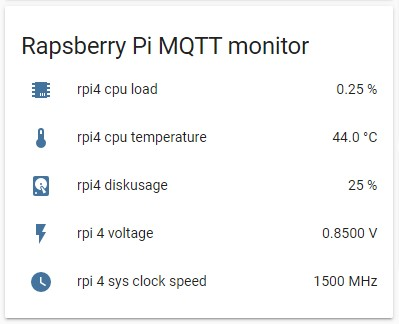

#  Raspberry Pi MQTT Monitor

[](https://github.com/hjelev/rpi-mqtt-monitor/releases)
[](https://github.com/hjelev/rpi-mqtt-monitor)
[](https://github.com/hjelev/rpi-mqtt-monitor/issues)
[](https://github.com/hjelev/rpi-mqtt-monitor/issues?q=is%3Aissue+is%3Aclosed)
[](https://github.com/hjelev/rpi-mqtt-monitor)
[](https://github.com/hjelev/rpi-mqtt-monitor)

<p align="center">
  
</p>

The easiest way to monitor your Raspberry Pi or Linux system health in [Home Assistant](https://www.home-assistant.io/) — up and running in minutes with zero manual HA configuration.

## Features

- **Zero-config Home Assistant setup** — MQTT discovery messages create devices and sensors automatically
- **Remote control** — restart, shutdown, and update your device from Home Assistant
- **Flexible delivery** — publish over MQTT or directly via the Home Assistant REST API
- **Run as a service or cron job** — auto-configured by the installer
- **External sensor support** — DS18B20 (temperature) and SHT21 (temperature + humidity)
- **Sensor availability** — sensors are marked unavailable in HA when readings fail
- **Multi-language** — English, German, French, and Bulgarian
- **Easy updates** — run `rpi-mqtt-monitor --update` or trigger from the Home Assistant UI

## What Gets Monitored

| Metric | Config key | Default |
|---|---|---|
| CPU load | `cpu_load` | enabled |
| CPU temperature | `cpu_temp` | enabled |
| Used disk space | `used_space` | enabled |
| Used disk space on extra paths/drives | `used_space_paths` | disabled |
| Memory usage | `memory` | enabled |
| Uptime (timestamp) | `uptime` | enabled |
| Uptime (seconds) | `uptime_seconds` | disabled |
| Network data sent/received | `net_io` | enabled |
| Swap usage | `swap` | disabled |
| CPU clock speed | `sys_clock_speed` | disabled |
| CPU voltage | `voltage` | disabled |
| WiFi signal quality (%) | `wifi_signal` | disabled |
| WiFi signal strength (dBm) | `wifi_signal_dbm` | disabled |
| RPi 5 fan speed | `rpi5_fan_speed` | disabled |
| RPi power/throttle status | `rpi_power_status` | disabled |
| HDD/SSD temperature | `drive_temps` | disabled |
| SSD SMART status | `ssd_health` | disabled |
| SSD wear / life used (%) | `ssd_health` | disabled |
| SSD power-on hours | `ssd_health` | disabled |
| SSD data written (TB) | `ssd_health` | disabled |
| APT updates available | `apt_updates` | disabled |
| Intel GPU render busy (%) | `intel_gpu_render` | disabled |
| Intel GPU video busy (%) | `intel_gpu_video` | disabled |
| Intel GPU frequency (MHz) | `intel_gpu_freq` | disabled |
| Intel GPU power (W) | `intel_gpu_power` | disabled |
| NVIDIA GPU utilization (%) | `nvidia_gpu_util` | disabled |
| NVIDIA GPU memory (%) | `nvidia_gpu_mem` | disabled |
| NVIDIA GPU frequency (MHz) | `nvidia_gpu_freq` | disabled |
| NVIDIA GPU power (W) | `nvidia_gpu_power` | disabled |
| NVIDIA GPU temperature (°C) | `nvidia_gpu_temp` | disabled |
| AMD GPU utilization (%) | `amd_gpu_util` | disabled |
| AMD GPU memory (%) | `amd_gpu_mem` | disabled |
| AMD GPU frequency (MHz) | `amd_gpu_freq` | disabled |
| AMD GPU power (W) | `amd_gpu_power` | disabled |
| AMD GPU temperature (°C) | `amd_gpu_temp` | disabled |
| Script update available | `git_update` | enabled |
| External sensors | `ext_sensors` | disabled |

> **GPU sensors.** The installer autodetects your GPU vendor and enables the matching sensors.
> - **Intel** uses `intel-gpu-tools` (`intel_gpu_top`); it requires root, so values only populate when running as the systemd service.
> - **NVIDIA** uses the native `pynvml` library (`nvidia-ml-py`) and the NVIDIA driver — no root required.
> - **AMD** reads `sysfs` (`/sys/class/drm`, in-kernel `amdgpu` driver) with no extra tools — no root required.

> **SSD health.** The installer autodetects non-rotating drives (NVMe and SATA SSDs) and offers to install `smartmontools` and enable the `ssd_health` sensors. `smartctl` needs root, so values populate when running as the systemd service, or in cron mode via the passwordless sudoers entry the installer adds for `smartctl`. NVMe metrics come from the uniform SMART health log; SATA wear and data-written are read from the vendor attribute table and are best-effort (they vary by manufacturer).

## Table of Contents

- [Installation](#installation)
  - [Automated](#automated)
  - [Manual](https://github.com/hjelev/rpi-mqtt-monitor/wiki/Manual-Installation)
- [Uninstallation](#uninstallation)
- [CLI Reference](#cli-reference)
- [Configuration](https://github.com/hjelev/rpi-mqtt-monitor/wiki/Configuration)
  - [External Sensors](https://github.com/hjelev/rpi-mqtt-monitor/wiki/External-Sensors)
- [Home Assistant Integration](#home-assistant-integration)
- [How to Update](https://github.com/hjelev/rpi-mqtt-monitor/wiki/How-to-update)
- [Feature Requests](#feature-requests)

## Installation

### Automated

```bash
bash <(curl -s https://raw.githubusercontent.com/hjelev/rpi-mqtt-monitor/master/remote_install.sh)
```

The installer will:
- Install missing dependencies (`git`, `python3`, `pip`, `paho-mqtt`, `requests`, `psutil`)
- Create a Python virtual environment (`rpi_mon_env`)
- Prompt you to configure MQTT host and credentials in `config.py`
- Set up a systemd service or cron job

> Running as a **service** is recommended — it enables the restart, shutdown, and display control buttons in Home Assistant.

### Automated Installation Preview

[](https://asciinema.org/a/726rhsITLusB88xL4VGPdU2sJ)

### Manual

See the [Manual Installation wiki page](https://github.com/hjelev/rpi-mqtt-monitor/wiki/Manual-Installation) for step-by-step instructions including service and cron configuration.

## Uninstallation

```bash
rpi-mqtt-monitor --uninstall
```

## CLI Reference

```
usage: rpi-mqtt-monitor [-h] [-H] [-d] [-s] [-v] [-u] [-w] [--uninstall]

Monitor CPU load, temperature, frequency, free space, etc., and publish the
data to an MQTT server or Home Assistant API.

options:
  -h, --help       show this help message and exit
  -H, --hass_api   send readings via Home Assistant API (not via MQTT)
  -d, --display    display values on screen
  -s, --service    run as a service; sleep interval set in config.py
  -v, --version    display installed version and exit
  -u, --update     update script and config then exit
  -w, --hass_wake  display Home Assistant wake-on-LAN configuration
  --uninstall      uninstall rpi-mqtt-monitor and remove all related files
```

## Configuration

All options live in `src/config.py`. Key settings:

| Setting | Description |
|---|---|
| `mqtt_host` | MQTT broker address |
| `mqtt_user` / `mqtt_password` | MQTT credentials |
| `mqtt_port` | MQTT port (default `1883`, `8883` for TLS) |
| `mqtt_tls` | Enable TLS/SSL for the MQTT connection |
| `mqtt_tls_ca_certs` / `mqtt_tls_insecure` | Optional CA file for a self-signed broker cert, or skip cert verification |
| `mqtt_websockets` / `mqtt_websocket_path` | Connect over MQTT-over-WebSockets (ports ~9001/8084) and its URL path |
| `mqtt_discovery_prefix` | HA discovery prefix (default `homeassistant`) |
| `mqtt_topic_prefix` | Topic prefix (default `rpi-MQTT-monitor`) |
| `mqtt_uns_structure` | Optional UNS prefix prepended to all topics |
| `discovery_messages` | Publish HA auto-discovery config messages |
| `service_sleep_time` | Seconds between readings when running as a service |
| `update_check_interval` | Seconds between update checks (default `3600`) |
| `use_availability` | Mark sensors unavailable in HA on read failure |
| `retain` | Set MQTT retain flag on published messages |
| `qos` | MQTT QoS level (`0`, `1`, or `2`) |
| `language` | UI language: `en`, `de`, `fr`, `bg` |
| `ha_device_name` | Override hostname as the HA device name |
| `hass_host` / `hass_token` | Home Assistant API URL and long-lived token |
| `restart_button` | Add a restart button to HA |
| `shutdown_button` | Add a shutdown button to HA |
| `display_control` | Add display on/off buttons to HA (auto-detects backend: see below) |
| `display_on_command` / `display_off_command` | Optional custom commands for display control (override auto-detection) |
| `group_messages` | Send all values as a single CSV message (disables discovery) |

Full configuration reference: [Configuration wiki](https://github.com/hjelev/rpi-mqtt-monitor/wiki/Configuration)

### Display control backends

With `display_control = True`, the monitor on/off buttons auto-detect a working backend for the current environment:

| Environment | Backend used |
| --- | --- |
| X11 desktop | `xset dpms force on/off` |
| wlroots Wayland (Pi labwc/wayfire, sway) | `wlr-randr --output <out> --on/--off` |
| Raspberry Pi | `vcgencmd display_power 1/0` |
| GNOME / generic Wayland | `ddcutil` (DDC/CI, hardware level) |

GNOME and most non-wlroots Wayland compositors expose no CLI to force monitors off, so external monitors are controlled over **DDC/CI** with `ddcutil`. When you enable display control during `install.sh`, the installer detects your backend and offers to perform this setup for you. To do it manually:

```bash
sudo apt install ddcutil
echo i2c-dev | sudo tee /etc/modules-load.d/i2c-dev.conf
sudo modprobe i2c-dev
sudo usermod -aG i2c $USER     # the service runs as this user; re-login or restart the service afterwards
ddcutil detect                 # confirm your monitor(s) are listed
```

Each monitor must have **DDC/CI enabled in its on-screen (OSD) menu** — some ship with it off.

If none of the above fits your setup, set `display_on_command` / `display_off_command` in `config.py` to any custom command, which always takes precedence over auto-detection.

## Home Assistant Integration

When `discovery_messages = True` (the default), a new MQTT device is created in Home Assistant automatically — no `configuration.yaml` edits required. Just add it to a dashboard.

### Home Assistant API

To bypass MQTT and push directly to the HA REST API, use the `--hass_api` flag and configure `hass_host` and `hass_token` in `config.py`.

### Wake on LAN

Run `rpi-mqtt-monitor --hass_wake` to print the YAML snippet for a Home Assistant Wake-on-LAN switch preconfigured with your device's MAC address and IP.

### Home Assistant Dashboard

<p align="center">
  
</p>

## External Sensors

Supports DS18B20 (1-Wire temperature) and SHT21 (I²C temperature + humidity) sensors.

Configure in `config.py`:

```python
ext_sensors = [
    ["Housing", "ds18b20", "0014531448ff", -300],
    ["ext2",    "sht21",   0,              [-300, 0]],
]
```

Full setup guide: [External Sensors wiki](https://github.com/hjelev/rpi-mqtt-monitor/wiki/External-Sensors)

## Feature Requests

Open an [issue](https://github.com/hjelev/rpi-mqtt-monitor/issues) or submit a pull request — contributions are welcome.
